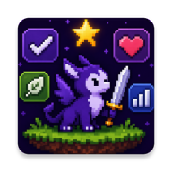

<!-- ====================== HEADER ====================== -->

<p align="center">
  
</p>

<p align="center">
  
</p>

<p align="center">
  
  
  
  
</p>

---

## 👨‍💻 About

Android developer with **3 years of Kotlin experience**. I build complete products — from UI and architecture to backend APIs, databases, and deployment. Not demos.

Currently open to Android opportunities.

---

## ⚡ Tech Stack

<p align="center">
  
</p>

<table align="center">
<tr>

<td align="center" width="33%">


**Mobile**

Kotlin · Jetpack Compose · Material 3
Kotlin Multiplatform · Navigation
Room · WorkManager

</td>

<td align="center" width="33%">


**Backend**

ASP.NET Core · Entity Framework Core
Ktor · REST APIs
PostgreSQL · SQLite · Railway

</td>

<td align="center" width="33%">


**Architecture**

Clean Architecture · MVVM
Repository Pattern · Dependency Injection
Koin · Offline-first · Testing

</td>

</tr>
</table>

---

## 📌 Featured Projects

---

#  LifeTracker

<p align="center">
  
  
  
  
</p>

<p align="center">
  <b>Full-stack gamified productivity application built with modern Android architecture.</b>
</p>

---

| Layer | Stack |
|-------|-------|
|  Android | Kotlin · Jetpack Compose · Clean Architecture · Koin · Room · Retrofit · WorkManager |
|  Backend | ASP.NET Core · Entity Framework Core · PostgreSQL · Railway |

---

**Highlights:**

- 🎯 Real client-server architecture with offline-first sync and conflict resolution
- 📡 Typed `NetworkResult` · 🛡 Custom `SafeApiCaller`
- ✨ Glassmorphism Bottom Navigation
- 🎒 Inventory mechanics · 🏆 Daily quests · 🔥 Streak system · 📊 Statistics dashboard

---

<details>
<summary><b>🏗 Architecture</b></summary>

```
                 UI
                 │
         Jetpack Compose
                 │
            ViewModel
                 │
           Repository
        ┌────────┴────────┐
        │                 │
      Room           Retrofit
        │                 │
     SQLite        ASP.NET Core API
                          │
                     PostgreSQL
```

</details>

---

#  TradeLog

<p align="center">
  
  
  
  
</p>

<p align="center">
  <b>Cross-platform trading journal for Android & Desktop with AI-assisted analytics.</b>
</p>

---

| Layer | Stack |
|-------|-------|
|  Application | Kotlin Multiplatform · Compose Multiplatform · SQLDelight · Ktor Client |
|  AI | OpenRouter |

---

**Highlights:**

- 📱 Shared Android + Desktop codebase · 📐 Adaptive UI via `WindowSizeClass`
- 📊 Analytics by pair, setup, weekday and session
- 💼 Multi-account portfolio · 💰 Commission & swap-adjusted P&L · 📅 Daily P&L heatmap
- 🎯 Prop-firm challenge tracking · 🤖 AI-generated trade reviews · ☁ Cloud-ready architecture

---

<details>
<summary><b>🏗 Architecture</b></summary>

```
          Android        Desktop
               │             │
               └──────┬──────┘
                      │
        Compose Multiplatform UI
                      │
                 Shared Domain
                      │
                 Shared Data
              ┌───────┴────────┐
              │                │
         SQLDelight       Ktor Client
              │                │
         Local Cache      AI Services
```

</details>

---

## 🧠 Philosophy

I enjoy building software that solves real problems — complete products with scalable architecture, production-ready code, polished UI/UX, backend infrastructure, testing, and long-term maintainability.

---

## 🚀 Current Focus

- Multi-module Gradle architecture
- Performance & optimization
- Backtesting engine (TradeLog)
- UI polish & animations
- Kotlin Multiplatform improvements
- Testing (JUnit5 + MockK)

---

## 📊 GitHub Stats

<p align="center">
  
  
</p>

<p align="center">
  
</p>

<p align="center">
  
</p>

---

## 📫 Contact

<p align="center">
  <a href="mailto:alexgaydle@gmail.com">
    
  </a>
  <a href="https://t.me/graydle">
    
  </a>
  <a href="https://www.linkedin.com/in/alex-gaydel-264622288/">
    
  </a>
</p>

<p align="center">
  
</p>
